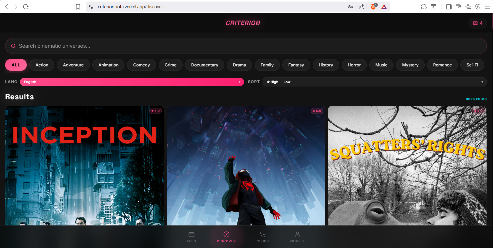
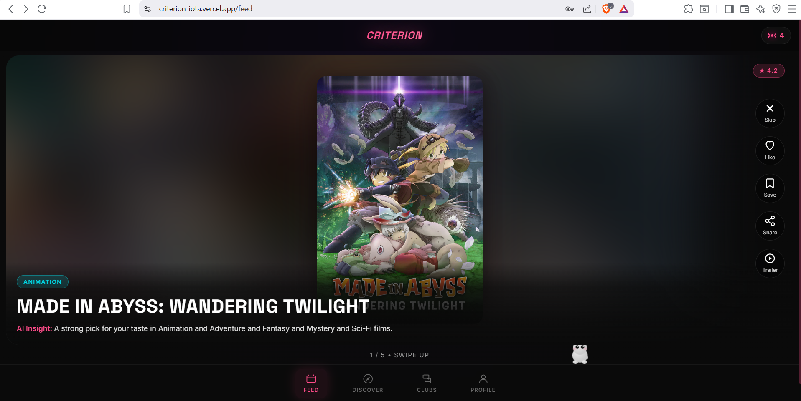
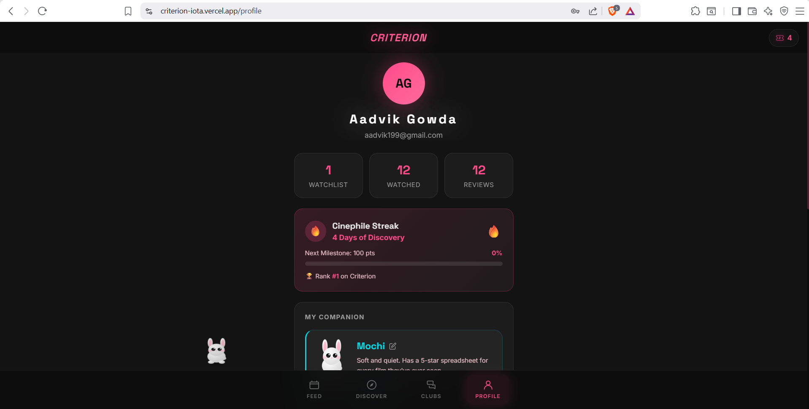
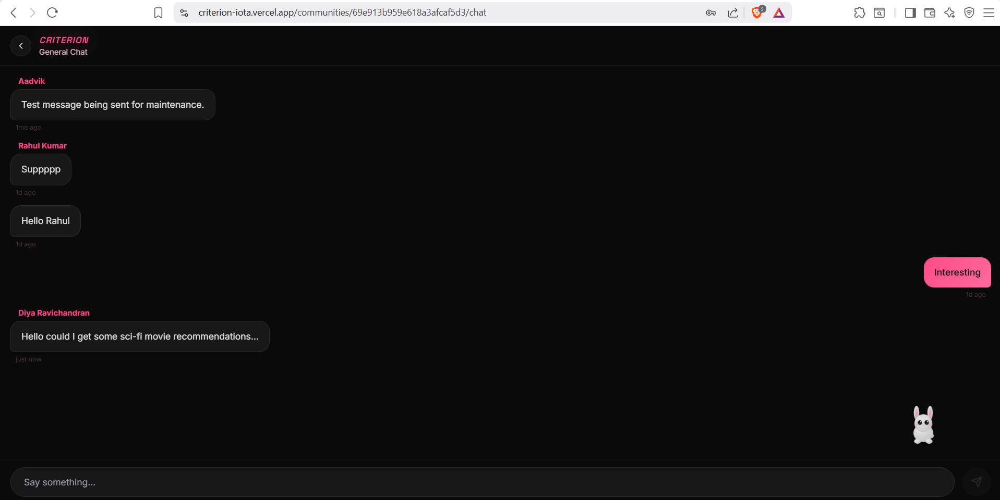
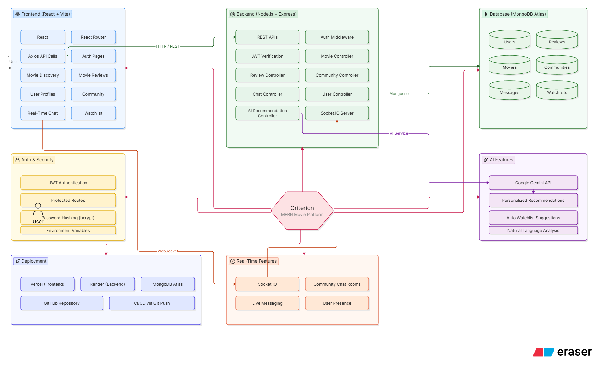

# Criterion

> A full-stack movie review and community platform powered by the MERN stack, Socket.IO, and AI-powered recommendations.

🌐 **Live Demo:** https://criterion-iota.vercel.app/

💻 **GitHub Repository:** https://github.com/HexaXcodes/criterion

---

## 📖 About The Project

Criterion is a full-stack movie review and social platform designed to help users discover movies, share opinions, engage in discussions, and connect with fellow movie enthusiasts.

The platform combines movie discovery, community interaction, real-time communication, and AI-assisted recommendations into a single experience.

More importantly, Criterion represents my first complete end-to-end software project that progressed from an idea and design phase to a fully deployed production application.

---

##  Features

###  Movie Discovery

* Browse popular movies
* Search movies instantly
* View detailed movie information
* Explore ratings and reviews

### Reviews & Ratings

* Create movie reviews
* Rate movies
* Read community feedback
* Share opinions with other users

### User Accounts

* Secure registration and login
* JWT-based authentication
* User profiles
* Personalized movie activity

### Watchlists

* Create and manage watchlists
* Save movies for later viewing
* Organize personal movie collections

### AI-Powered Recommendations

* Personalized movie suggestions
* Google Gemini integration
* Smart recommendation assistance

### Community & Real-Time Chat

* Community discussion groups
* Real-time messaging using Socket.IO
* Interactive movie discussions
* Live communication between users

---

## System Architecture

```text
User
 │
 ▼
React + Vite Frontend
 │
 ├── REST API Requests
 ├── Authentication
 ├── Watchlists
 ├── Reviews
 └── Community Features
 │
 ▼
Node.js + Express Backend
 │
 ├── JWT Authentication
 ├── Socket.IO Server
 ├── AI Recommendation Engine
 ├── Movie APIs
 ├── User Management
 └── Community Services
 │
 ▼
MongoDB Atlas
 │
 ├── Users
 ├── Reviews
 ├── Watchlists
 ├── Messages
 └── Communities

Additional Integrations:
Google Gemini API
TMDB API
Resend Email Service
```

---

## Tech Stack

### Frontend

* React
* Vite
* React Router
* Axios
* CSS

### Backend

* Node.js
* Express.js
* Socket.IO
* JWT
* bcrypt

### Database

* MongoDB Atlas
* Mongoose

### AI & APIs

* Google Gemini API
* TMDB API

### Deployment

* Vercel (Frontend)
* Render (Backend)
* MongoDB Atlas (Database)
* GitHub (Version Control)

---

## Screenshots

### Landing Page



### Community Feed



### User Profile



### Real-Time Chat



### System Architecture



## Installation

### Clone Repository

```bash
git clone https://github.com/HexaXcodes/criterion.git
cd criterion
```

### Backend Setup

```bash
cd backend
npm install
```

### Frontend Setup

```bash
cd frontend
npm install
```

---

## Environment Variables

Create a `.env` file inside the backend directory:

```env
PORT=5000

MONGO_URI=your_mongodb_connection_string

JWT_SECRET=your_jwt_secret

TMDB_API_KEY=your_tmdb_api_key

GEMINI_API_KEY=your_gemini_api_key

RESEND_API_KEY=your_resend_api_key

FRONTEND_URL=https://criterion-iota.vercel.app
```

Create a `.env` file inside the frontend directory:

```env
VITE_API_URL=https://criterion-ws50.onrender.com/api

VITE_SOCKET_URL=https://criterion-ws50.onrender.com
```

---

## Deployment

### Frontend

Deployed using Vercel:

https://criterion-iota.vercel.app/

### Backend

Deployed using Render.

### Database

Hosted on MongoDB Atlas.

---

## Challenges & Learnings

Criterion taught me lessons that extended far beyond coding features.

During development, I learned:

* Designing and structuring a scalable MERN application
* Building REST APIs
* Managing MongoDB relationships and schemas
* Implementing secure JWT authentication
* Integrating AI services into a production application
* Building real-time communication systems with Socket.IO
* Managing environment variables securely
* Deploying full-stack applications to production
* Debugging deployment-specific issues
* Solving frontend routing problems in production environments

Perhaps the most valuable lesson was learning how to move from a project that works locally to one that runs reliably in production.

---

## Future Improvements

* Enhanced recommendation engine
* Movie recommendation explanations
* Friend system
* User notifications
* Improved moderation tools
* Mobile application support
* Advanced analytics dashboard
* Enhanced social features

---

## Author

**Aadvik Gowda**

GitHub:
https://github.com/HexaXcodes

Project Repository:
https://github.com/HexaXcodes/criterion

Live Demo:
https://criterion-iota.vercel.app/

---

 If you found this project interesting, consider giving the repository a star.
